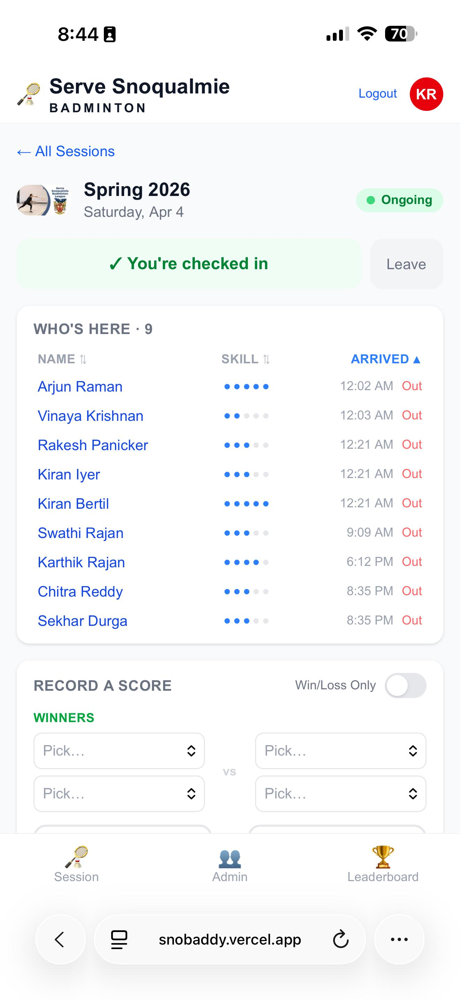
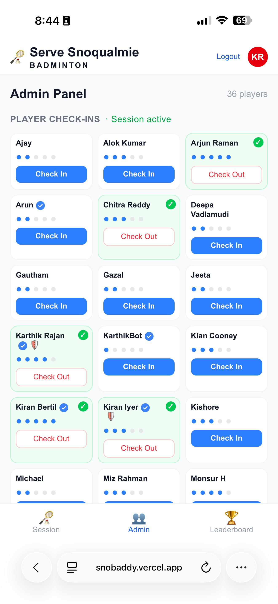
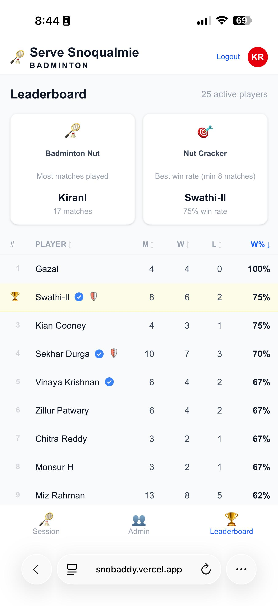
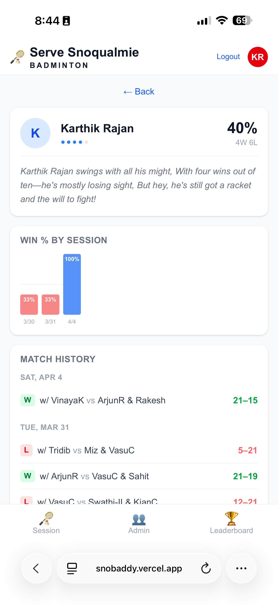
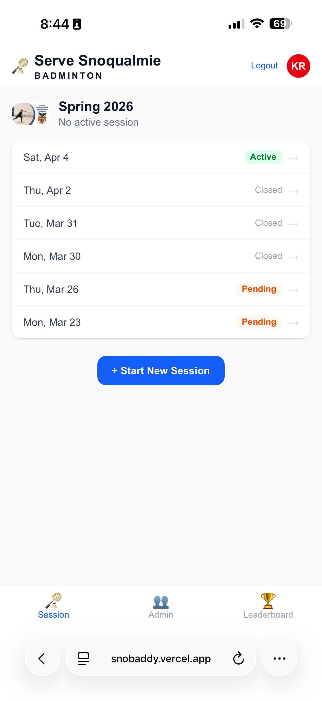
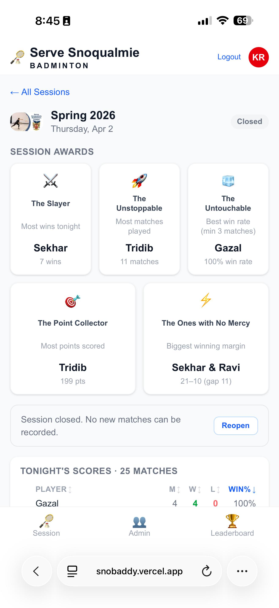

<p align="center">
  
</p>

<h1 align="center">snobaddy</h1>

<p align="center">
  <em>A digital whiteboard for a Monday/Thursday badminton club in Snoqualmie, WA.<br/>
  An engineering marvel. A beautifully over-engineered piece of art that absolutely no one asked for.</em>
</p>

<p align="center">
  <a href="https://churchontheridge.churchcenter.com/registrations/events/category/35751">
    Serve Snoqualmie Sports →
  </a>
</p>

---

## Screenshots

<p align="center">
  
  
  
</p>
<p align="center">
  
  
  
</p>

---

## The Story

Once upon a time, a badminton club in Snoqualmie showed up to the court every Monday and Thursday with a whiteboard, some markers, and a dream. Players would scrawl their names, someone would track wins and losses in increasingly illegible chicken scratch, and by the end of the night nobody could read who won what.

This app fixes that. It is a **session and season tracker** for a drop-in doubles club — ~30–50 players, 2 courts, two nights a week. Instead of the whiteboard, you pull out your phone, check in, record your matches, and watch the live scoreboard update in real time.

It is, objectively, a *lot* more engineering than a whiteboard requires. The database has foreign keys. There is a pre-commit hook. There are server components. There is a CI/CD pipeline that deploys to a global edge network.

The whiteboard cost $4.99 at Target.

We regret nothing.

---

## What it does

- Players check in when they arrive, check out when they leave
- Admins start and close sessions; anyone with the app can see who's here
- Record a doubles match: pick 4 players, split into teams, enter the score
- Live session scoreboard: W / L / Win% for tonight, updates after every match
- Season leaderboard: cumulative stats across the whole season
- Admin tools: edit skill levels, correct match scores, delete bad entries, soft-remove players

---

## What it does not do (yet)

- No real-time push — refresh to update
- No match scheduling or court assignment
- No payment or registration integration
- No per-session history browsing

---

## For the nerds

### Tech stack

| Layer | Technology |
|---|---|
| Framework | Next.js 14 (App Router, TypeScript) |
| Styling | Tailwind CSS |
| Database | Supabase (PostgreSQL + RLS) |
| Auth | Supabase Auth (Google OAuth) |
| Deployment | Vercel (auto-deploy on push to `main`) |
| Source | GitHub |

### Project structure

```
src/
  middleware.ts                        # Auth guard — redirects unauthenticated users to /login
  app/
    layout.tsx                         # Root layout
    login/page.tsx                     # Google OAuth sign-in page
    onboarding/page.tsx                # First-login skill level picker
    auth/callback/route.ts             # OAuth callback — creates player record
    (app)/                             # Authenticated route group
      layout.tsx                       # App shell: Header + BottomNav
      page.tsx                         # Session tab (home)
      players/page.tsx                 # Player registry
      leaderboard/page.tsx             # Season leaderboard
    api/
      players/route.ts                 # GET all players
      players/[id]/route.ts            # PATCH skill level (admin only)
      players/[id]/delete/route.ts     # POST soft-delete player (admin only)
      players/[id]/restore/route.ts    # POST restore player (admin only)
      matches/route.ts                 # POST a match result
      matches/[id]/route.ts            # PATCH score / DELETE match (admin only)
      sessions/[id]/start/route.ts     # Admin: activate session
      sessions/[id]/checkin/route.ts   # Check self or player in
      sessions/[id]/checkout/route.ts  # Check self or player out
      sessions/[id]/close/route.ts     # Admin: close session
      sessions/[id]/reopen/route.ts    # Admin: reopen completed session
  components/
    Header.tsx                         # Fixed top bar with logo + logout avatar
    BottomNav.tsx                      # Fixed bottom nav: Session / Players / Leaderboard
    StartSessionButton.tsx             # Admin: start pending session
    CheckInButton.tsx                  # Self check-in / check-out
    AdminPresenceToggle.tsx            # Admin: per-player check-in/out on players page
    SkillEditor.tsx                    # Admin: inline skill level editor (dots)
    RecordMatchForm.tsx                # Full-screen match recording form
    MatchAdminControls.tsx             # Admin: edit scores / delete match inline
    CloseSessionButton.tsx             # Admin: close active session
    ReopenSessionButton.tsx            # Admin: reopen completed session
  lib/
    supabase.ts                        # Server DB client (service role key — bypasses RLS)
    supabase-server.ts                 # Server auth client (anon key + cookies)
    supabase-browser.ts                # Browser auth client (anon key)
    db/
      players.ts                       # Player queries + admin email list
      sessions.ts                      # Session queries + presence
      matches.ts                       # Match queries + scoreboard computation
```

### Database tables

| Table | Purpose |
|---|---|
| `health_check` | Connectivity check |
| `players` | All players (`user_id` nullable for manually-added players; `deleted_at` for soft-delete) |
| `seasons` | Season definitions (name, start/end date) |
| `sessions` | Individual Mon/Thu sessions, linked to a season |
| `session_players` | Check-in records (player × session, with `checked_out_at`) |
| `matches` | Match results (4 player IDs, scores, `winning_team`) |

### Environment variables

Copy `.env.local.example` to `.env.local` and fill in values. Never commit `.env.local`.

| Variable | Scope | Where to find it |
|---|---|---|
| `SUPABASE_URL` | Server only | Supabase → Project Settings → API → Project URL |
| `SUPABASE_SERVICE_ROLE_KEY` | Server only | Supabase → Project Settings → API → service_role |
| `NEXT_PUBLIC_SUPABASE_URL` | Browser + server | Same URL as above |
| `NEXT_PUBLIC_SUPABASE_ANON_KEY` | Browser + server | Supabase → Project Settings → API → anon/public |

All four must also be set in Vercel dashboard → Project → Settings → Environment Variables.

### Admin setup

Admin emails are whitelisted in `src/lib/db/players.ts` → `ADMIN_EMAILS`.
New admins get the flag automatically on first login if their email is in that list.
To grant admin to an existing player:

```sql
UPDATE players SET is_admin = true WHERE email = 'email@example.com';
```

### Coding conventions

- All DB access goes through `src/lib/db/*.ts` — never query Supabase directly in components
- Use `createClient()` from `supabase-server` for auth-aware reads (respects RLS)
- Use `supabase` from `supabase.ts` (service role) for admin writes that must bypass RLS
- Prefer React Server Components for read-only data fetching
- Use `"use client"` only when you need interactivity (forms, buttons)
- API routes live in `src/app/api/` — one file per resource
- Keep components thin — business logic goes in `src/lib/db/`
- No ORMs — use the Supabase JS client directly
- Tailwind only for styling
- Mobile-first — this app is used on phones at the court

### Local development

```bash
npm install
cp .env.local.example .env.local   # fill in your Supabase keys
npm run dev                         # http://localhost:3000
```

### Deployment

Push to `main` on GitHub. Vercel auto-deploys. That's it.

For the first deploy, set the four environment variables in the Vercel dashboard (one-time setup).

### AI agent notes

This project supports both Claude Code and Gemini CLI working concurrently.

- `CLAUDE.md` — loaded automatically by Claude Code
- `GEMINI.md` — loaded automatically by Gemini CLI
- `AGENTS.md` — shared agent protocol (loaded by both via `@AGENTS.md` in CLAUDE.md)
- `BACKLOG.md` — single source of truth for planned and in-progress work
- `specs/` — detailed spec per feature, written before implementation begins
- `CHANGELOG.md` — user-facing release notes
- `releases/` — technical release notes per version

A git pre-commit hook (`scripts/pre-commit`) blocks any commit that touches `src/` without also updating `CHANGELOG.md`. Install it with:

```bash
bash scripts/install-hooks.sh
```

---

<p align="center">
  Built with unnecessary sophistication for a very good Tuesday night.<br/>
  <a href="https://churchontheridge.churchcenter.com/registrations/events/category/35751">Come play with us.</a>
</p>
