<p align="center">
  
</p>

<h1 align="center">snobaddy</h1>

<p align="center">
  <em>A digital whiteboard for a Monday/Thursday badminton club in Snoqualmie, WA.<br/>
  An engineering marvel. A beautifully over-engineered piece of art that absolutely no one asked for.</em>
</p>

<p align="center">
  <a href="https://snobaddy.vercel.app"><strong>→ Open the App ←</strong></a>
</p>

<p align="center">
  <a href="https://kbrovibes.github.io/snobaddy/"><strong>Project page</strong></a> — what it is, a screenshot tour, and the honest FAQ.
</p>

<p align="center">
  <em>Want to play? We're at <a href="https://churchontheridge.churchcenter.com/registrations/events/category/35751">Serve Snoqualmie Sports</a> — Mondays and Thursdays.</em>
</p>

---

## Screenshots

**Session flow**

<p align="center">
  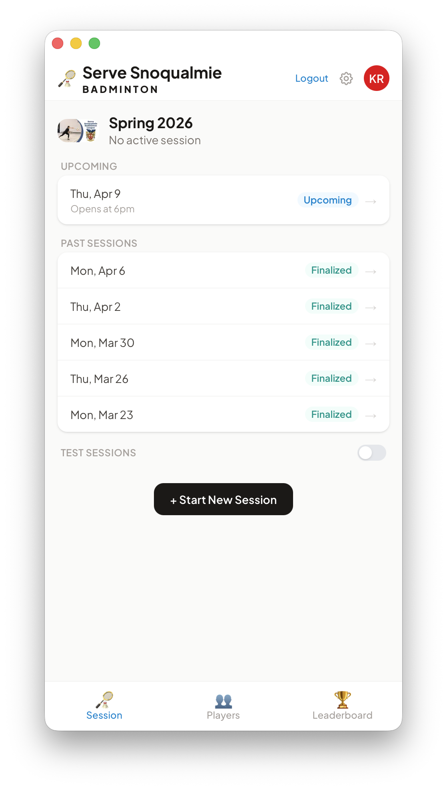
  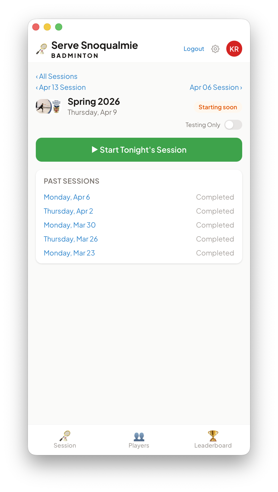
  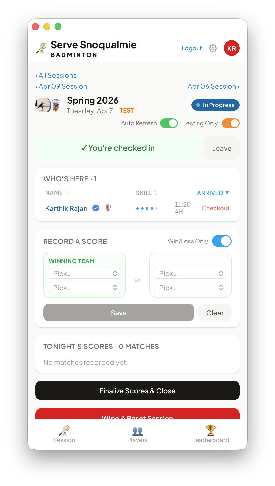
</p>
<p align="center"><em>Session list &nbsp;·&nbsp; Upcoming session &nbsp;·&nbsp; Active session check-in</em></p>

**Players & leaderboard**

<p align="center">
  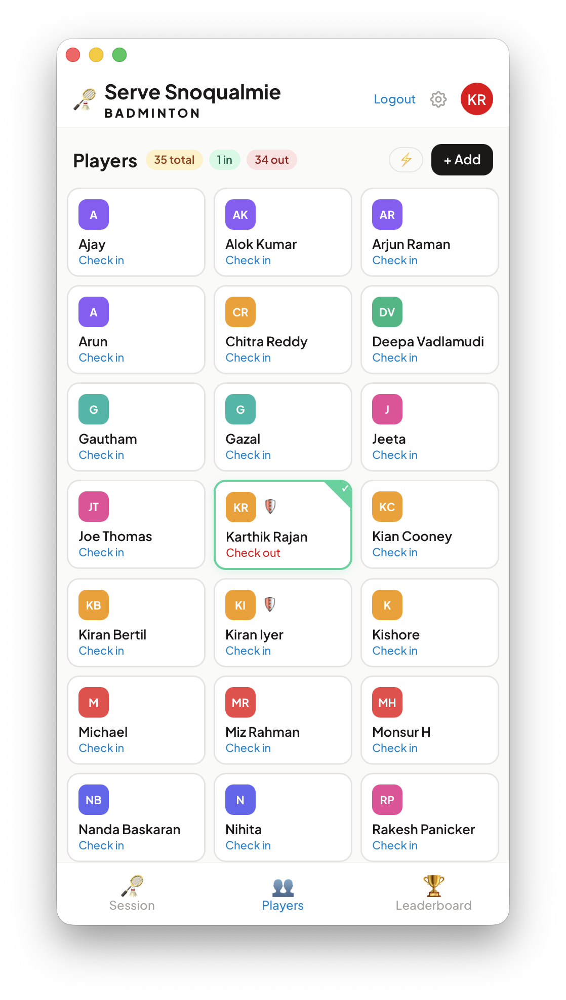
  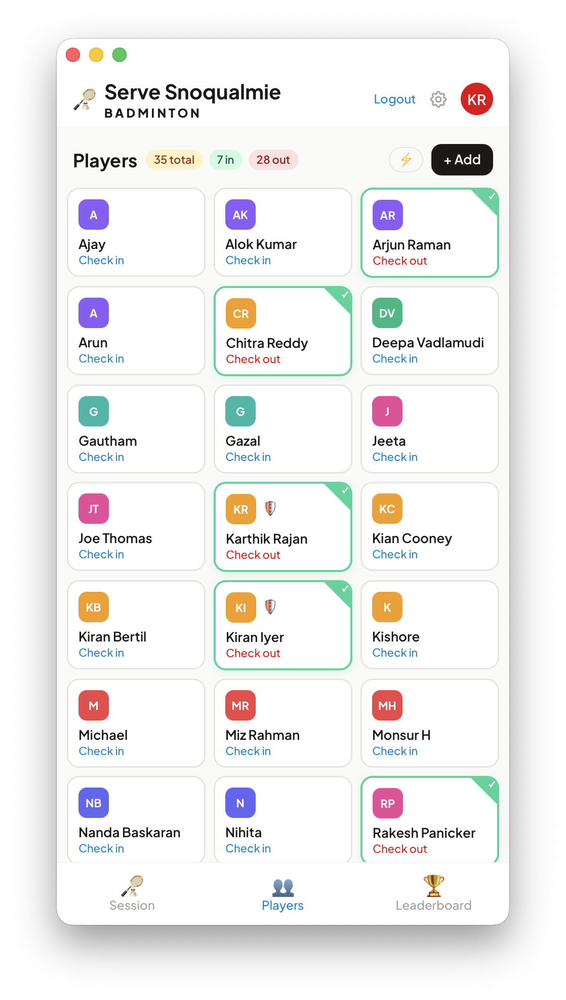
  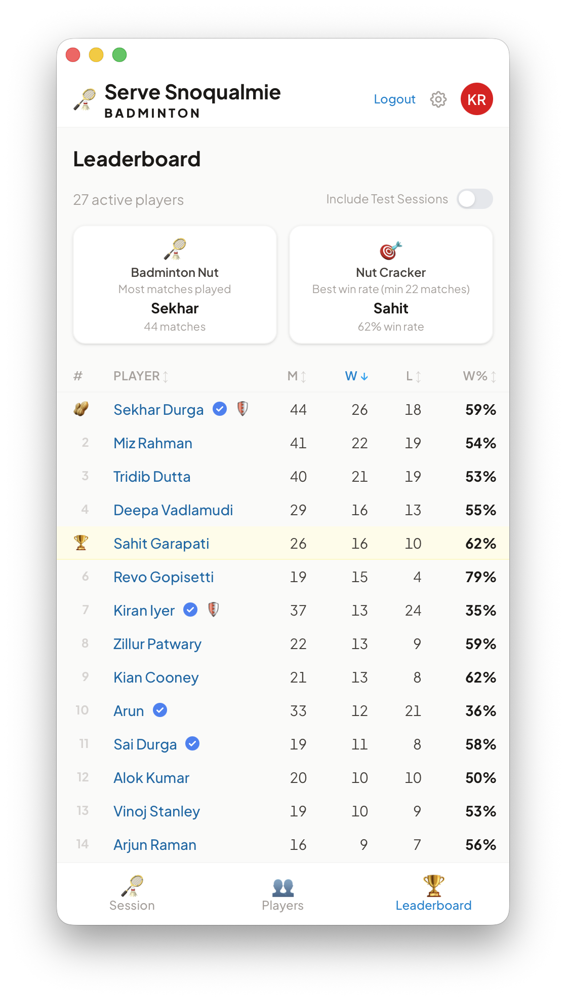
</p>
<p align="center"><em>Players list &nbsp;·&nbsp; Players with check-ins &nbsp;·&nbsp; Season leaderboard</em></p>

**Recording matches**

<p align="center">
  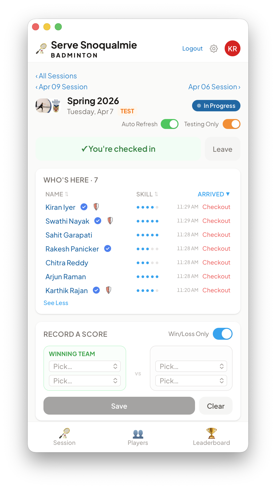
  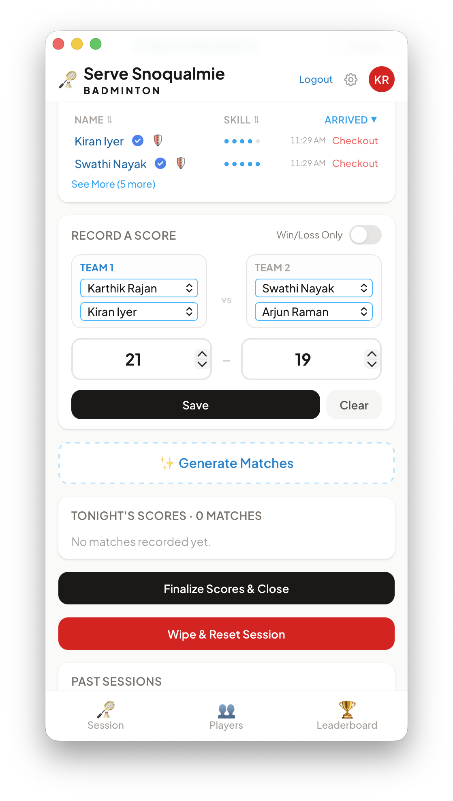
  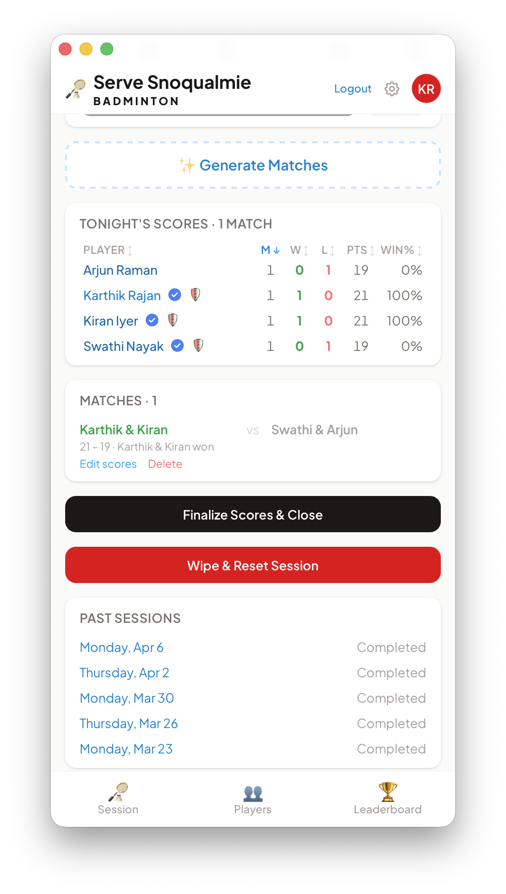
</p>
<p align="center"><em>Who's Here &nbsp;·&nbsp; Score entry + match generator &nbsp;·&nbsp; Live scoreboard</em></p>

**End of night**

<p align="center">
  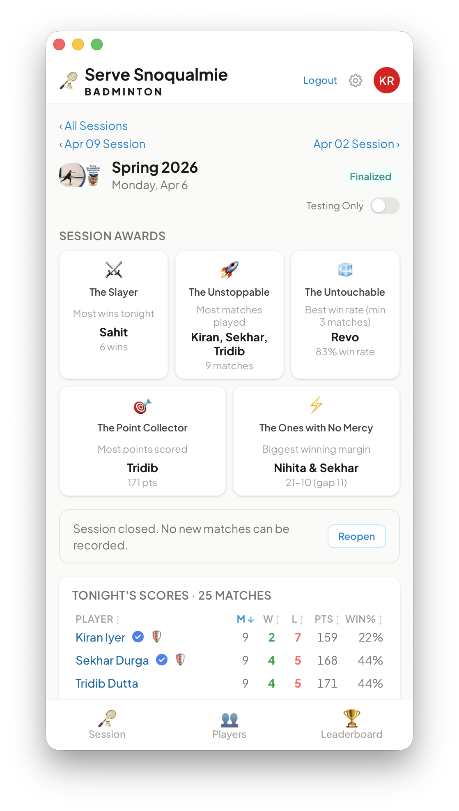
  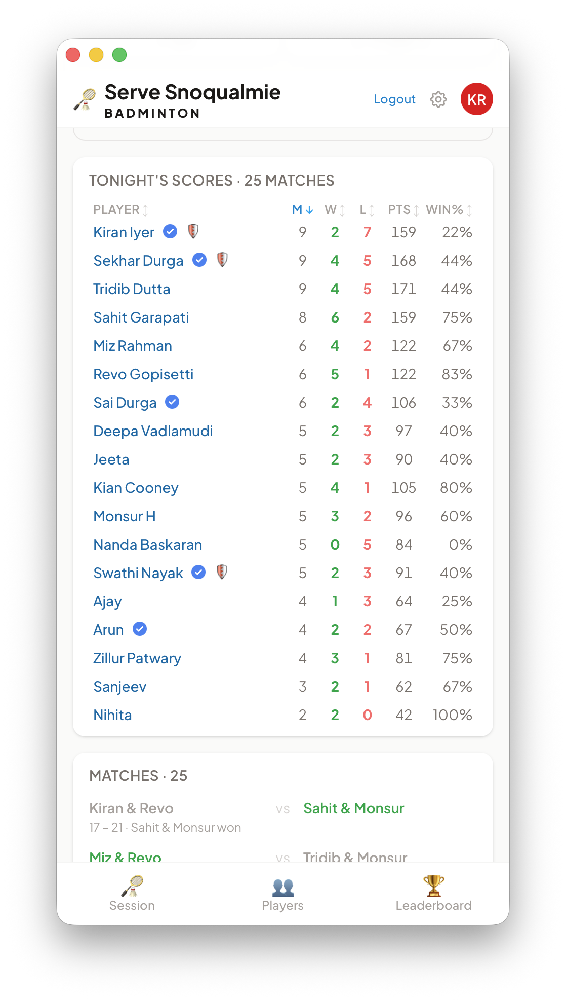
  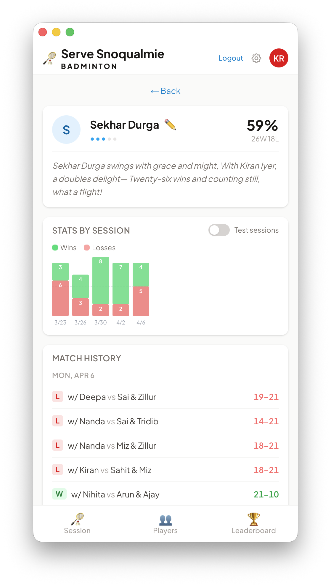
</p>
<p align="center"><em>Session awards &nbsp;·&nbsp; Final scoreboard (25 matches) &nbsp;·&nbsp; Player profile</em></p>

### Interactive Mockups

Clickable HTML prototypes for every flow in the app — authentication, sessions, match recording, players, leaderboard, finals setup, and match day.

**[View Interactive Mockups](https://kbrovibes.github.io/snobaddy/mockups/)**

> To regenerate mockups after UI changes, run `/regenerate-mockups` in Claude Code.

---

## The Story

Once upon a time, a badminton club in Snoqualmie showed up to the court every Monday and Thursday with a whiteboard, some markers, and a dream. Players would scrawl their names, someone would track wins and losses in increasingly illegible chicken scratch, and by the end of the night nobody could read who won what.

This app fixes that. Pull out your phone, check in, record your matches, and watch the live scoreboard update in real time.

It is, objectively, a *lot* more engineering than a whiteboard requires. The database has foreign keys. There is a pre-commit hook. There are server components. There is a CI/CD pipeline that deploys to a global edge network.

The whiteboard cost $4.99 at Target.

We regret nothing.

---

## A Typical Night

**Before the first shuttle is struck**, an admin opens the app and taps "Start Session." That's it — the session is live.

**Players arrive** and tap "Check In" on the session screen. They immediately appear in the **Who's Here** list, visible to everyone with the app open. The list shows each player's skill level, their arrival time, and a green dot if they have the app open on their phone right now.

**When enough players are checked in**, the admin taps **✨ Generate Matches**. The algorithm reads the room: who just played, who's been waiting, what the skill levels are — and proposes a queue of fair, balanced matchups across both courts. No more "same five people playing each other all night."

**Players play.** Someone records the score in two taps (simple mode: just pick winners and losers). The live scoreboard updates instantly. Wins, losses, win% — all right there.

**End of the night**, the admin closes the session. Everyone gets their **session awards**: The Slayer (most wins), The Unstoppable (most matches), The Point Collector, and a few others. The stats roll up into the **season leaderboard** automatically.

---

## Features

### For everyone
- **Check in / check out** — tap to join tonight's session; tap again when you leave
- **Who's Here** — live list of who's on the court right now, with skill level dots and online indicator
- **Live session scoreboard** — W / L / Win% for every player tonight, sortable by any column
- **Match history** — full log of tonight's matches with scores and winners
- **Season leaderboard** — cumulative W / L / Win% for the whole season, with rankings
- **Player profiles** — tap any player's name to see their win% chart per session and full match history
- **AI-generated player poem** — each profile features a short funny poem about the player, generated by AI and updated as their stats change
- **Session awards** — handed out when a session closes: The Slayer, The Unstoppable, The Point Collector, The One with No Mercy, and more
- **Season awards** — 🏸 Badminton Nut (most matches played) and 🎯 Nut Cracker (best win rate among contenders)

### For admins
- **Start / close / reopen sessions** — full session lifecycle control
- **Match generation** — propose the next fair batch of matches with one tap; the algorithm balances skill, wait time, and avoids repeating matchups
- **Simple vs. Full scoring mode** — toggle per session: Simple mode (⚡) is quick win/loss only; Full mode (🔢) captures actual scores
- **Admin check-in panel** — check any player in or out from a card grid; see at a glance who's present
- **Edit / delete matches** — fix a wrong score or remove a bad entry inline
- **Skill level editing** — update any player's skill rating (1–5) from the admin panel
- **Soft-delete and restore players** — remove a player without losing their history
- **Admin badge** — red avatar so you always know when you're logged in with admin privileges

### For walk-ins
- Guests can be manually added to the player list without creating an account
- They show up in matches, scoreboard, and leaderboard just like everyone else

---

## Who Can Use It

| Role | Description |
|---|---|
| **Player** | Anyone who signs in with Google or email. Checks in, records matches, sees stats. |
| **Admin** | Whitelisted email addresses. Full control over sessions, matches, and player management. |
| **Walk-in / Guest** | Manually added by an admin. No account needed — they just show up and play. |

---

## Sign In

| Method | How |
|---|---|
| **Google OAuth** | One tap — name and photo pulled from your Google account automatically |
| **Email + Password** | Create an account with a display name, email, and password |
| **Forgot Password** | Email reset link sent instantly |

First-time users land on a quick onboarding screen to pick their skill level (Beginner → Pro). Takes about 10 seconds.

---

## The Algorithm

The match generator isn't random. For each proposed match it:

1. **Prioritises players who have been waiting longest** — if you checked in 45 minutes ago and haven't played, you're going first
2. **Avoids back-to-back matches** for the same players — everyone gets rest time
3. **Balances teams by skill** — all three possible 2v2 splits are evaluated; the most even split wins
4. **Avoids repeating the same matchups** — a strong penalty ensures you don't play the same opponents every round
5. **Auto-fills the queue** — after a score is recorded or a player checks out, the queue tops itself back up automatically

With 16+ players it maintains a 4-match deep queue across 2 courts. With fewer players the queue shrinks proportionally.

---

## Tech Stack

| Layer | Technology |
|---|---|
| Framework | [Next.js](https://nextjs.org) (App Router, TypeScript) |
| Styling | [Tailwind CSS](https://tailwindcss.com) |
| Database | [Supabase](https://supabase.com) (PostgreSQL + Row Level Security) |
| Auth | Supabase Auth (Google OAuth + Email/Password) |
| AI | [Claude](https://claude.ai) (AI SDK — player poem generation) |
| Deployment | [Vercel](https://vercel.com) (auto-deploys on push to `main`) |
| Source | [GitHub](https://github.com/kbrovibes/snobaddy) |
| AI Dev Agent | [Claude Code](https://claude.ai/code) (feature development by conversation) |

---

## How This Gets Built

Here's the part that's genuinely cool: almost every feature in this app was shipped by having a conversation with **Claude Code**, committing the result, and pushing to GitHub. Vercel picks up the push and has a new production deployment live in under 30 seconds.

The workflow is:

```
"Hey, add session awards when a session closes"
     ↓
Claude Code reads the codebase, writes the code, updates the changelog
     ↓
git push
     ↓
Vercel auto-deploys
     ↓
< 30 seconds later, it's live on everyone's phone >
```

No build scripts to wrangle. No deployment steps to remember. Just describe what you want, review the diff, push. That's the whole thing.

---

## For the Nerds

### Database tables

| Table | Purpose |
|---|---|
| `players` | All players (`user_id` nullable for walk-ins; `deleted_at` for soft-delete) |
| `seasons` | Season definitions (name, start/end date) |
| `sessions` | Individual Mon/Thu sessions, linked to a season |
| `session_players` | Check-in records (player × session, with `checked_out_at`) |
| `matches` | Match results (4 player IDs, scores, `winning_team`) |
| `proposed_matches` | Algorithm-generated match suggestions (with `deleted_at` for soft-delete) |
| `player_poems` | AI-generated poems, cached and refreshed when match count changes |

### Environment variables

Copy `.env.local.example` to `.env.local` and fill in values. Never commit `.env.local`.

| Variable | Scope | Where to find it |
|---|---|---|
| `SUPABASE_URL` | Server only | Supabase → Project Settings → API → Project URL |
| `SUPABASE_SERVICE_ROLE_KEY` | Server only | Supabase → Project Settings → API → service_role |
| `NEXT_PUBLIC_SUPABASE_URL` | Browser + server | Same URL as above |
| `NEXT_PUBLIC_SUPABASE_ANON_KEY` | Browser + server | Supabase → Project Settings → API → anon/public |
| `ANTHROPIC_API_KEY` | Server only | Anthropic console → API Keys |

All five must also be set in Vercel dashboard → Project → Settings → Environment Variables.

### Admin setup

Admin emails are whitelisted in `src/lib/db/players.ts` → `ADMIN_EMAILS`.
New admins get the flag automatically on first login if their email is in the list.
To grant admin to an existing player:

```sql
UPDATE players SET is_admin = true WHERE email = 'email@example.com';
```

### Local development

```bash
npm install
cp .env.local.example .env.local   # fill in your Supabase + Anthropic keys
npm run dev                         # http://localhost:3000
```

### Coding conventions

- All DB access goes through `src/lib/db/*.ts` — never query Supabase directly in components
- Prefer React Server Components for read-only data; `"use client"` only when you need interactivity
- API routes live in `src/app/api/` — one file per resource
- Keep components thin — business logic goes in `src/lib/db/`
- Tailwind only for styling — mobile-first, since this is used on phones at the court

---

---

## Reporting Bugs

You found a bug? Congratulations. Unfortunately, there is no official bug tracking system, no support email, no ticketing queue, no SLA, no on-call rotation, and absolutely no obligation on anyone's part to fix anything. This is a free app built for a badminton club. The whiteboard it replaced cost $4.99.

**You are not eligible to report bugs.**

That said — if you *really* know me, and I mean *really* know me (like, you have my number, you know my coffee order, you've seen me flail on the court), feel free to ping me through my personal messaging apps. You know which one. If you don't know which one, you don't know me well enough. Best of luck with your bug.

---

<p align="center">
  Built with unnecessary sophistication for a very good Tuesday night.<br/>
  <a href="https://churchontheridge.churchcenter.com/registrations/events/category/35751">Come play with us.</a>
</p>
